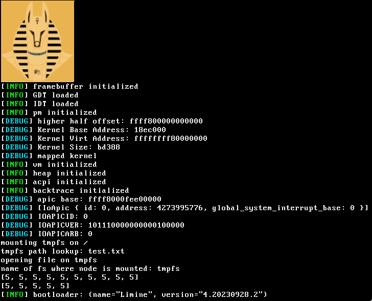

# xernel
A kernel that tries to support multiple architectures/platforms using a hybrid kernel architecture.
It's using the limine protocol.
Mostly made for learning purposes, no real-world application.

## Building
For building, you simply need a working Rust installation with the nightly toolchain installed and the `mtools` package which we use for the generation of the disk image.
We use xtask as our workflow for building and running the kernel.
Therefore, the command `cargo kernel` is used.

See `cargo kernel help` for a list of subcommands and available flags.

You can simply use `cargo kernel build` or `cargo kernel run`, it is going to use x86_64 as the default target.

## Contact
Feel free to reach out to `lockna` or `mp1310` on Discord
or join our **Offical Discord Server:** https://discord.gg/e3gsmHX4w4

Here you can talk to us in the `xernel-development` category.

## TODO
Things that are still to do:
- [ ] Add doc comments
- [ ] Rewrite mem module
    - [x] Rewrite the page frame allocator so it uses a buddy allocator
    - [ ] Rewrite the virtual memory manager, just make it better
    - [ ] Switch from linked_list_allocator to a slab allocator for heap
- [ ] Implement a virtual file system
- [ ] Implement a driver system
- [ ] Implement a proper syscall interface
- [ ] Implement a proper userspace
- [ ] Implement a proper init system

## Contributing
Contributions to code and documentation are heavily appreciated, may it be a bug fix or an improvement of the existing code or code documentation.
New features would be gladly taken over by us, as the project was created for exactly this purpose.

## License
xernel is distributed under the terms of either the Apache License (Version 2.0) or the MIT license, at the user's choice.
See [LICENSE-APACHE](./LICENSE-APACHE) and [LICENSE-MIT](./LICENSE-MIT) for details.
Contributions to the xernel project must be made under the terms of both licenses.
